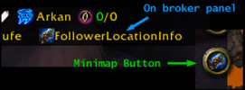
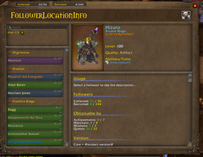
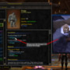

# FollowerLocationInfo (WoW AddOn)

&nbsp; &nbsp; &nbsp; &nbsp;

## Description
This addon is a collection of known locations of followers to collect them.

## Please use for
- Bug reports & feature requests > the issues tracker on project page
- Comments & Criticism > the comment area on addon page

## Chat command / Commandline options
**Usage:**

`/followerlocationinfo <command>`

`/fli <command>`

Both can be used without a command to get the list of available commands

**Available commands:**

- journal | Show/Hide journal frame
- minimap | Show/Hide minimap button
- reset | Reset addon settings - the use of this command auto reload the ui to apply the reset

## Localization
[Localization tool](https://www.curseforge.com/wow/addons/followerlocationinfo/localization) is open and needs some input.

## Credits
For translation: Thanks at ditex2009(ruRU), Shooshpan(ruRU), michaelselehov(ruRU), ananhaid(zhCN,zhTW), jerry99spkk(zhTW) and BNSSNB(zhTW).

## My other projects
* [On Curseforge](https://www.curseforge.com/members/hizuro_de/projects)
* [On Github](https://github.com/HizurosWoWAddOns?tab=repositories)

## Disclaimer
> World of Warcraft© and Blizzard Entertainment© are all trademarks or registered trademarks of Blizzard Entertainment in the United States and/or other countries. These terms and all related materials, logos, and images are copyright © Blizzard Entertainment.
